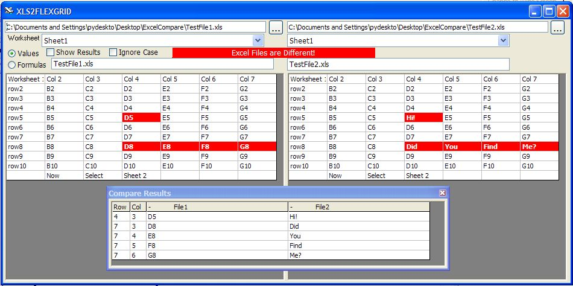



## ExcelCompare

### Description

This code will load 2 excel files into grid controls and compare the contents and show the differences both by highlighting the cells in grid controls and also by listing the different cells in a third grid.
 
### More Info
 
select each file to compare (I attached 2 different excel files as an example).

The Original example for loading excel into a grid control is at :

http://www.Planet-Source-Code.com/vb/scripts/ShowCode.asp?txtCodeId=61399&amp;lngWId=1

and was submitted by Cristiano Couto.

I modified it to open 2 excel files and compare each cell.

shows the differences

less aggravation when sorting through the many versions of the same excel file.

             |
---                |---
**Submitted On**   |2005-10-28 21:10:48
**By**             |[Tom Pydeski](https://github.com/Planet-Source-Code/PSCIndex/blob/master/ByAuthor/tom-pydeski.md)
**Level**          |Intermediate
**User Rating**    |5.0 (40 globes from 8 users)
**Compatibility**  |VB 6\.0
**Category**       |[Complete Applications](https://github.com/Planet-Source-Code/PSCIndex/blob/master/ByCategory/complete-applications__1-27.md)
**World**          |[Visual Basic](https://github.com/Planet-Source-Code/PSCIndex/blob/master/ByWorld/visual-basic.md)
**Archive File**   |[ExcelCompa19441810282005\.zip](https://github.com/Planet-Source-Code/tom-pydeski-excelcompare__1-63064/archive/master.zip)

### API Declarations

see code

